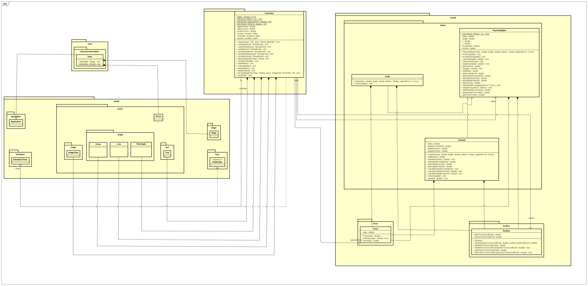
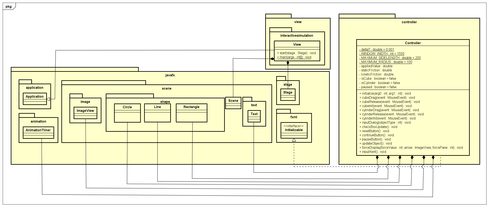

# OOP_Group18_InteractiveSimulation
## Project Description
A simple interactive simulation for demonstrating Newton’s laws of motion.
This is a mini-project created by Group 18 in semester 2023.2 for Object-Oriented Programming Course at Hanoi University of Science and Technology.
## Contributors:
| Full name           | Student ID   | Contribution                                                                                                                   |
---------------------|------------  |--------------------------------------------------------------------------------------------------------------------------------|
| Ngo Minh Trung      |20226004      | GUI, class PhysicalObject, class Cylinder, class Force, class Cube, class Surface, Use case diagram, Report + Slide prepartion |
| Phan Hoang Tu       | 20226068     | Testing application on Terminal, General Class Diagram                                                                         |
| Dang Trong Van      | 20226072     | Detailed Class Diagram                                                                                 |

## Diagrams
### General Class Diagram:
Location: [Design/ClassDiagram.png](Design/General_Class_Diagram.png)

### Detailed Class Diagram:
Location: [Design/Class_Diagram.png](Design/Class_Diagram.png)

### GUI class diagram
Location: [Design/GUI_class_diagram.png](Design/GUI_class_diagram.png)

### Model package class diagram
Location: [Design/GUI_class_diagram.png](Design/Model_Class_Diagram.png)

### Usecase diagram:
Location: [Usecase/UseCaseDiagram.png](Usecase/UseCaseDiagram.png)

## Demo 
  Experience how our project works with this demonstration: [Demo Link](https://drive.google.com/file/d/1NLIkhn11kc8dD9bCNWWKvwizjR59NYKG/view?usp=sharing][DemoVideo).

## License
This project is licensed under the MIT License. See the [LICENSE](LICENSE) file for more details.