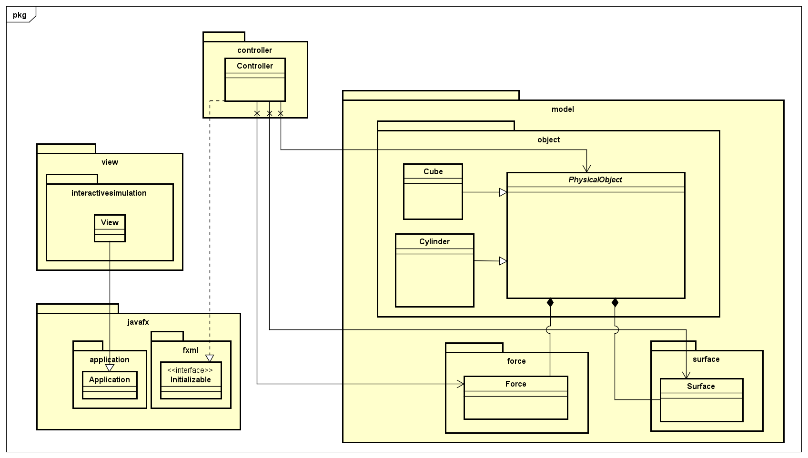
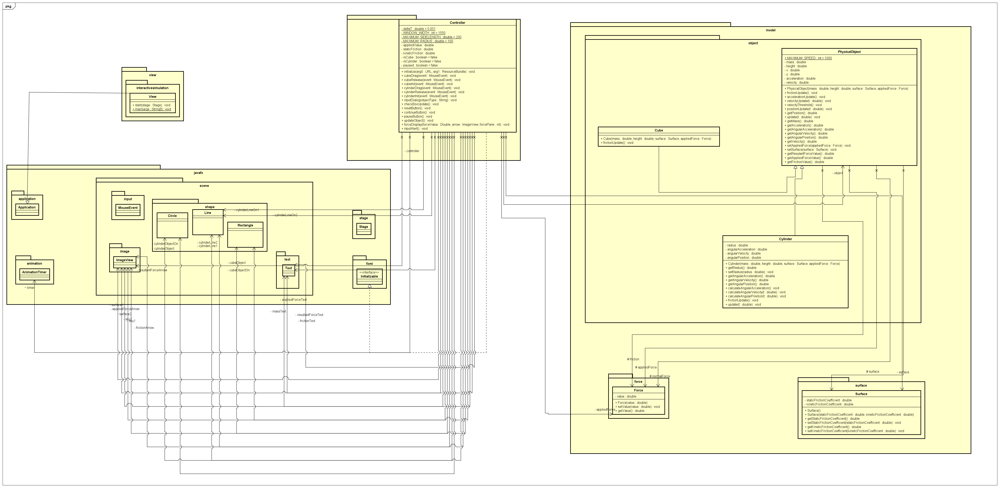
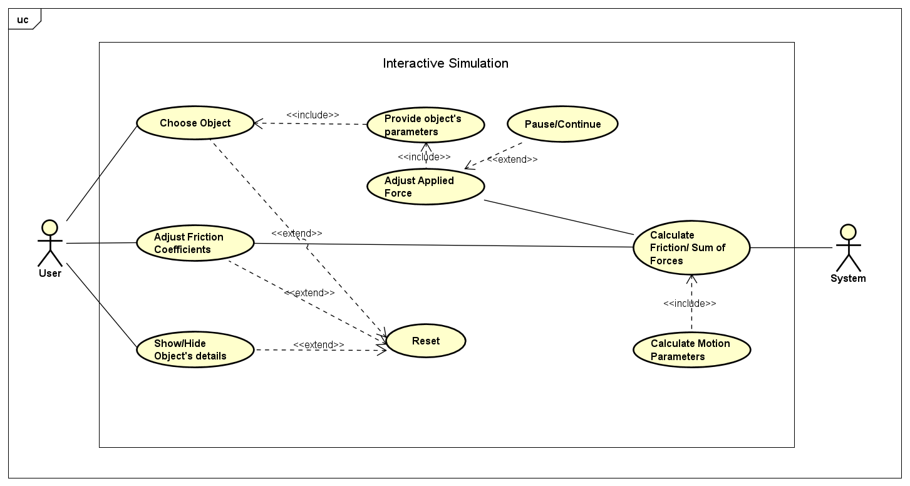

# OOP_Group18_InteractiveSimulation
## Project Description
A simple interactive simulation for demonstrating Newton’s laws of motion.
## Members:
| Full name           | Student ID   | Contribution |
--------------------  |------------  |--------------|
| Ngo Minh Trung      |20226004      | GUI, class PhysicalObject, class Cylinder, class Force, class Cube, class Surface, Use case diagram|
|Phan Hoang Tu        | 20226068     | Testing application on Terminal, General Class Diagram|
|Dang Trong Van       | 20226072     | Detailed Class Diagram, Slide Preparation|

## General Class Diagram:
Location: [Design/ClassDiagram.png](Design/ClassDiagram.png)

## Detailed Class Diagram:
Location: [Design/ClassDiagram.png](Design/ClassDiagram.png)

## Usecase diagram:
Location: [Usecase/UseCaseDiagram.png](Usecase/UseCaseDiagram.png)

## Demo
  [DemoVideo](https://drive.google.com/file/d/1NLIkhn11kc8dD9bCNWWKvwizjR59NYKG/view?usp=sharing][DemoVideo)
